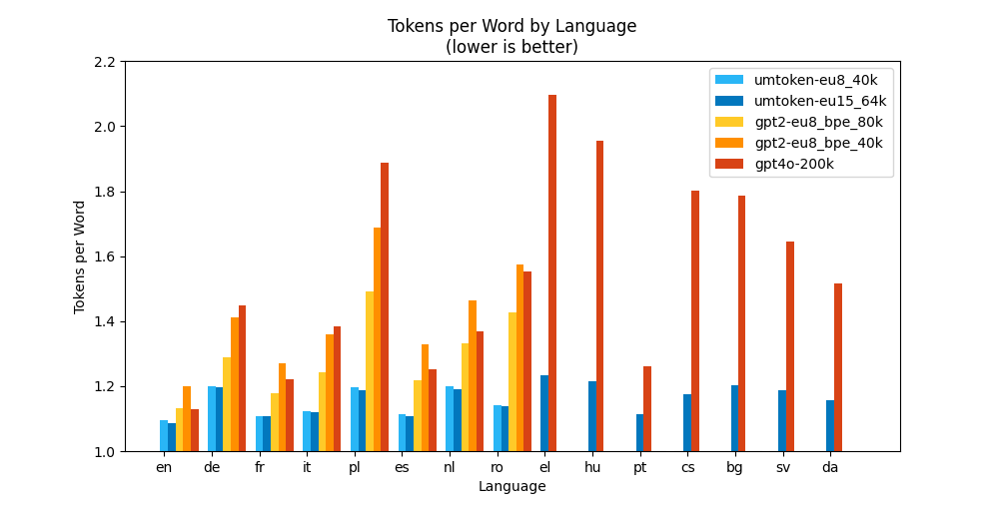

# Unimorph Tokenizer (umtoken)

## Motivation

Text needs to be tokenized before it can be processed by neural language models such as translation models or LLMs.

Standard tokenizers such as BPE (Byte Pair Encoding) and WordPiece work well for languages such as English and Chinese that do not have a rich morphology.

However, for many European languages with rich morphology such as Romance languages, Slavic languages, or some Germanic languages, the number of tokens (subwords) per word can be very high. The subwords are often quite different between inflected forms of the same word and are often not meaningful. Worse, the subwords depend on the case and leading whitespace of the input word.

Here is an example from the tokenizer of the GPT-4o model by OpenAI ([try yourself](http://tokenizers.ipappify.de/)):
- The French word "chlorofluorocarbone" is tokenized into the subwords "chlor", "of", "lu", "or", "ocar", "bone" (😕 the chlor of what bone 🦴? lu or ocar?).

Language models that use such tokenizers may have a hard time learning the meaning of words and may not be able to generalize well to unseen words, word forms, or compound words. This is especially true for low-resource languages where the training data is scarce. 

More tokens per word also result in longer sequences which require more memory and computation during training and inference. The common solution to this problem is to use ever larger vocabularies. However, larger vocabularies also require more memory and computation for embedding and projection weights. For example, the [Llama 3.1 8B](https://huggingface.co/meta-llama/Llama-3.1-8B) model uses about 1 billion out of 8 billion parameters just for the embedding and projection layers.

The basic idea of the umtoken tokenizer is to factorize words into **tuples of vocabulary entries and properties**, so that a smaller vocabulary size and fewer tokens per word are needed. The vocabulary entries tend to be more meaningful than the subword units of standard tokenizers like BPE or WordPiece, and thus easier to digest for language models.

This is our motivation. To keep you motivated to read on, here is an comparison between the token per word ratios (**lower is better**) for **umtoken (blue)** and **other tokenizers (yellow to red)**:



The figure shows the tokens per word ratio by the 8 and 15 most commonly spoken languages in the EU (labeled as eu8 and eu15) on the huggingface dataset wikimedia/wikipedia, for: 
- umtoken-eu8_40k (`umtoken/assets/wikipedia_eu8_40k_l3--tied.json`, **40k** vocab size, trained on wikimedia/wikipedia for the eu8 languages)
- umtoken-eu15_64k (`umtoken/assets/wikipedia_eu15_64k_l3--tied.json`, **64k** vocab size, trained on wikimedia/wikipedia for the eu15 languages)
- standard BPE (gpt-2, **80k** vocab size, trained on wikimedia/wikipedia for the eu8 languages)
- standard BPE (gpt-2, **40k** vocab size, trained on wikimedia/wikipedia for the eu8 languages)
- openai (GPT-4o, ~**200k** vocab size)

Token per word ratios are close for English (en) among all tokenizers, but differ significantly for all other languages, especially for morphologically rich languages.

The umtoken tokenizer outperforms standard tokenizers in terms of tokens per word for all languages, even tokenizers with much larger vocabularies: Although trained on the same dataset, the **40k umtoken** tokenizer **outperforms** the **80k BPE** tokenizer with twice the vocabulary size.

## Description

**umtoken** is a tokenizer for multilingual text data that uses properties like morphological rules to generate a vocabulary of more meaningful tokens and fewer tokens per word. The tokenizer is based on a modified unigram model and is designed to be used in transformer-based models for natural language processing tasks.

The umtoken tokenizer is a rewrite of our [IP.Translator](https://www.ipappify.de/en/ip-translator) tokenizer, which we have been using for our translation models since 2021. The code has been cleaned up and optimized for readability. Some unnecessary features have been removed, and some (hopefully, all) minor design flaws have been fixed.

Here, is how it works ([try yourself](http://tokenizers.ipappify.de/)):

### Level 1

The tokenizer separates properties (leading whitespace: yes/no; case: lower, Title, UPPER) from words (e.g., " Einrichtung" \> "einrichtung"). The token id becomes a tuple of a vocab id and a property id which combines leading whitespace and case.

Here is an example for the word "system" with different cases and with/without leading whitespace:

| Word       | vocab_id  | Properties           | ws_id | up_id | prop_id       | token_id |
|------------|-----------|----------------------|-------|-------|---------------|----------|
| "system"   | 523       | ws: no, case: lower  |     0 |     0 | 0 + 0 * 2 = 0 | (523, 0) |
| " system"  | 523       | ws: yes, case: lower |     1 |     0 | 1 + 0 * 2 = 1 | (523, 1) |
| " System"  | 523       | ws: yes, case: Title |     1 |     1 | 1 + 1 * 2 = 3 | (523, 3) |
| " SYSTEM"  | 523       | ws: yes, case: UPPER |     1 |     2 | 1 + 2 * 2 = 5 | (523, 5) |

vocab_id is index of the token in the vocabulary (here, for example 523), ws_id is the value of the leading whitespace property, up_id is the value of the case property, prop_id is the value of the combined property, and token_id is the tuple of vocab_id and prop_id.

### Level 2 (optional)

The tokenizer separates stems from suffixes (e.g., "einrichtung" \> "einricht+ung") via preset suffix rules for the supported languages. The property id now combines rule id, leading whitespace, and case.

Returning to the example of the word "system", we can now add a rule for the plural suffix "+s" to the tokenizer:

| Word       | vocab_id  | Properties                     | ws_id | up_id | rule_id | prop_id       | token_id |
|------------|-----------|--------------------------------|-------|-------|---------|---------------|----------|
| "system"   | 523       | ws: no, case: lower, rule: /   |     0 |     0 |       1 | 0 + 0 * 2 + 1 * 6 = 6 | (523, 6) |
| " system"  | 523       | ws: yes, case: lower, rule: /  |     1 |     0 |       1 | 1 + 0 * 2 + 1 * 6 = 7 | (523, 7) |
| " System"  | 523       | ws: yes, case: Title, rule: /  |     1 |     1 |       1 | 1 + 1 * 2 + 1 * 6 = 9 | (523, 9) |
| " System**s**" | 523   | ws: yes, case: Title, rule: **+s** |     1 |     1 |     108 | 1 + 1 * 2 + 108 * 6 = 651 | (523, 651) |

### Level 3 (optional)

The rules may include morphological operations to transform bases (= vocabulary entries) into stems before the suffix is appended  (e.g., "run" \> "ru\[n-\>nn\]+ing").

### Examples

* umtoken-eu8_40k--tied (`umtoken/assets/wikipedia_eu8_40k_l3--tied.json`, **40k** vocab size, trained on wikimedia/wikipedia for en, de, fr, es, it, nl, pl, ro):

| Language | Word                 | Tokens                  | Properties           |
|----------|----------------------|-------------------------|----------------------|
| es       | "hablantes"          | "habl+antes"            | ws: no, case: lower |
| it       | " parlate"           | "parl+ate"              | ws: yes, case: lower |
| de       | " Einrichtung"       | "einricht+ung"          | ws: yes, case: Title |
| fr       | " CENTRIFUGEANT"     | "centrifug+eant"        | ws: yes, case: UPPER |
| en       | "running"            | "run\[n-\>nn\]+ing"     | ws: no, case: lower  |

### Supported Languages

Rules are currently available for the following languages
- Bulgarian (bg)
- Czech (cs)
- Danish (da)
- Dutch (nl)
- English (en)
- French (fr)
- German (de)
- Greek (el)
- Hungarian (hu)
- Italian (it)
- Polish (pl)
- Portuguese (pt)
- Romanian (ro)
- Spanish (es)
- Swedish (sv)

The effort required to design morphological rules is quite manageable:

When adding a new language, it is enough to define only a few common rules to achieve a significant reduction in the number of tokens per word. If no rules apply, the word is tokenized into subwords in the usual way.

The current rule set of umtoken already covers many high-resource languages with Latin script.
Just using these rules will already free up a significant amount of vocabulary space for other languages.

## Comparison

Standard tokenizers like BPE (Byte Pair Encoding) and WordPiece neither consider leading whitespace, case, nor morphological rules as further dimensions of a token. 

The following examples illustrate the differences between umtoken and common tokenizers.

### Compound Words

* openai (GPT-4o, BPE, ~200k vocab size):

| Language | Word                          | Tokens                                           |
|----------|-------------------------------|-------------------------------------------------|
| de       | "Fluorchlorkohlenwasserstoff" | "Fl" "u" "orch" "l" "ork" "oh" "len" "wasser" "stoff" |
| fr       | "chlorofluorocarbone"         | "chlor" "of" "lu" "or" "ocar" "bone" |

Tokens from the GPT-4o tokenziner are mostly meaningless, such as tokens "Fl" and "lu", or have a meaning unconncected to chlorofluorocarbon, such as tokens 'ork' or 'bone'.

* umtoken-eu8_40k--tied (`umtoken/assets/wikipedia_eu8_40k_l3--tied.json`, **40k** vocab size, trained on wikimedia/wikipedia):

| Language | Word                          | Tokens                          | Properties          |
|------|-------------------------------|---------------------------------|---------------------|
| de   | "Fluorchlorkohlenwasserstoff" | "fluor" "chlor" "kohl+en" "wasserstoff" | ws: no, case: Title |
| fr   | "chlorofluorocarbone"         | "chloro" "fluoro" "carbon+e"   | ws: no, case: lower |

Tokens from umtoken are **more meaningful**.

### Case and Whitespace

* openai (GPT-4o):

| Language | Word                          | Tokens                                           |
|----------|-------------------------------|-------------------------------------------------|
| de       | "Fluorchlorkohlenwasserstoff" | "Fl" "u" "orch" "l" "ork" "oh" "len" "wasser" "stoff" |
| de       | " Fluorchlorkohlenwasserstoff" | " Flu" "orch" "l" "ork" "oh" "len" "wasser" "stoff" |
| de       | " FLUORCHLORKOHLENWASSERSTOFF" | " FL" "U" "OR" "CH" "L" "ORK" "O" "HL" "EN" "W" "ASS" "ER" "ST" "OFF" |
| en       | " runners"                     | **" runners"**                      |
| en       | "sprinters/runners"            | "spr" "in" "ters" **"/r" "unners"** |

Tokens from the GPT-4o tokenziner are inconsistent and dependent on case and leading whitespace.

* umtoken-eu8_40k--tied:

| Language | Word                          | Tokens                          | Properties          |
|----------|-------------------------------|---------------------------------|---------------------|
| de       | "Fluorchlorkohlenwasserstoff" | "fluor" "chlor" "kohl+en" "wasserstoff" | ws: no, case: Title |
| de       | " Fluorchlorkohlenwasserstoff" | "fluor" "chlor" "kohl+en" "wasserstoff" | ws: yes, case: Title |
| de       | " FLUORCHLORKOHLENWASSERSTOFF" | "fluor" "chlor" "kohl+en" "wasserstoff" | ws: yes, case: UPPER |
| en       | " runners"                     | **"ru\[n-\>nn\]+ers"**                  | ws: yes, case: lower |
| en       | "sprinters/runners" | "sprint+ers" "/" **"ru\[n-\>nn\]+ers"** | all words: ws: no, case: lower |

Tokens from umtoken **do not depend on case or leading whitespace**. Case and leading whitespace are absorbed by the properties so that the tokens remain the same.

### Word Forms

* openai (GPT-4o):

| Language | Word                | Tokens                          |
|----------|---------------------|---------------------------------|
| fr       | "centrifuger"       | "centrif" **"uger"**               |
| fr       | "centrifugent"      | "centrif" **"ug"** "ent"           |
| fr       | "centrifugeant"     | "centrif" **"uge"** "ant"          |
| en       | "trim"              | **"trim"**                         |
| en       | "trimmable"         | **"tr"** **"imm"** "able"              |

Tokens from the GPT-4o tokenziner are inconsistent across word forms and are less meaningful.

* umtoken-eu8_40k--tied:

| Language | Word                | Tokens                  | Properties          |
|----------|---------------------|-------------------------|---------------------|
| fr       | "centrifuger"       | "centrifug+er"          | ws: yes, case: lower |
| fr       | "centrifugent"      | "centrifug+ent"         | ws: yes, case: lower |
| fr       | "centrifugeant"     | "centrifug+eant"        | ws: yes, case: lower |
| en       | "trim"              | "trim"                  | ws: yes, case: lower |
| en       | "trimmable"         | "tri\[m-\>mm\]+able"    | ws: yes, case: lower |

Tokens from umtoken are **more meaningful and consistent across word forms**.

## Installation

Clone the repository with git and install the package dependencies with pip (preferably in a virtual environment):

```bash
git clone https://github.com/ipappify/umtoken.git
pip install -e ./umtoken
```

To extract vocabulary from text data, you may need to install additional packages depending on the type of data files (e.g., `polars` for parquet files). You can install these additional packages with the following command:

```bash
pip install polars datasets pyzstd
```

For using the wrapper `UnimorphTokenizer` which makes the umtoken tokenizer available as a huggingface `PreTrainedTokenizerBase`, you need to have huggingface transforms installed:

```bash
pip install transformers
```

Under `umtoken/assets` you will find a few pretrained models.

## Integration

The umtoken tokenizer does not return a scalar token id but tuples of vocab id and property id. Transformer models must be adapted to accept these tuples as input. The following code snippet shows how to adapt the embedding and projection layers in pytorch.

Note that this examples uses 2-tuples `(vocab_id, property_id)`. When using many rules as for Slavic languages, it may be better to use 3-tuples `(vocab_id, rule_id, ws_id + 2 * up_id)`. This will help the model generalize to unseen combinations.

```python
import math
import torch
import torch.nn as nn
import torch.nn.functional as F

# ...

class TransformerLM(torch.module):
    def __init__(self, config):
        super().__init__()
        # setup layers etc.
        # ...

        # setup embeddings and projections
        model_dim = config.model_dim # dimension of the model
        model_low = math.min(1024, config.model_dim) # (optional) it's usually ok to reduce model_dim for projection of props if model_dim is large
        vocab_size = config.vocab_size # number of vocab ids
        props_size = config.props_size # number of rule ids * 3 (for cases) * 2 (for ws)

        self.emb_0 = nn.Embedding(vocab_size, model_dim)
        self.emb_1 = nn.Embedding(props_size, model_dim)
        self.prj_0 = nn.Linear(model_dim, vocab_size)
        self.prj_1 = nn.Linear(model_low, props_size)
        self.prj_linear = nn.Linear(2 * model_dim, model_low) # Gated Linear Unit (GLU) for autoregressive projection of props
        self.prj_gate = nn.Linear(2 * model_dim, model_low)

        # init weights the usual way
        # ...

    def forward(self, input_ids, labels=None):
        # the following code assumes that input_ids have a further dimension to accommodate the 2-tuples of vocab id and property id
        # e.g., (batch_size, seq_len, **2**)
        input_ids_0 = input_ids[..., 0]
        input_ids_1 = input_ids[..., 1]
        
        # if input_ids are packed into scalars, we need to unpack them:
        # e.g., input_ids_0 = input_ids % vocab_size, input_ids_1 = input_ids // vocab_size

        # embed: simply add embeddings
        x = self.emb_0(input_ids_0) + self.emb_1(input_ids_1)
        
        # apply transformer layers to x
        y = self.layers(x)

        # project to vocab: first, project to vocab (y_0)
        y_0 = self.prj_0(y)

        # the following code assumes training where we have labels or at least the complete input sequence
        if labels is None:
            # left-shift input_ids along sequence dim to obtain labels if not provided
            labels_0 = input_ids_0.roll(-1, dims=1) # assuming shape (batch_size, seq_len)
            labels_0[:,-1] = -100                   # mask last token, assuming -100 is used for loss masking
        
        # at inference, we would sample from y_0 first and use the result as labels_0
        # e.g., labels_0 = torch.argmax(y_0, dim=-1)
        # for top-k projection (required for beam search), see below

        # project to props: use GLU to merge transformer output y and vocab embedding x_0 for autoregressive projection to props (y_1)
        y_m = torch.cat((y, self.emb_0(labels_0.clamp(min=0))), dim=-1) # clamp to avoid negative indices (loss masking)
        y_m = self.prj_linear(y_m) * F.silu(self.prj_gate(y_m))
        y_1 = self.prj_1(y_m)
        
        # compute output (log_softmax/argmax over y_0 and y_1, loss, etc.)
        output = self.compute_output(y_0, y_1, labels)
        return output

    def project_topk(self, y, k, k_1 = None):
        # here is an example of how to project the model output for top-k sampling during inference.

        # the basic idea is to sample k vocab ids first, then combine them with the model output to sample k_1 prop ids.
        # finally, top-k samples are taken from the combined logits of vocab and props.
        # because shuffling dimensions and indexes is always a bit confusing, the example is intentionally kept verbose.
        # note that k_1 = 4 is more than enough for props, since props usually have low perplexity given the vocab id.
        # (we still use k_1 = k if not set).

        # assuming shape (batch_size, seq_len, model_dim),
        # where seq_len is the length of the current output and is usually 1 during inference
        B, T, C = y.shape

        # make sure there is no out-of-bounds error
        k_0 = min(k, config.vocab_size)
        k_1 = min(k_1 or k, config.props_size) 

        # project to vocab: (B, T, C) -> (B, T, vocab_size)
        y_0 = self.prj_0(y)
        y_0 = F.log_softmax(y_0, dim=-1)

        # top-k sampling with k_0: (B, T, vocab_size) -> (B, T, k_0), (B, T, k_0)
        logits_0, ids_0 = torch.topk(y_0, k=k_0, dim=-1)

        # expand model ouput: (B, T, C) -> (B, T, k_0, C) -> (B*T*k_0, C)
        y = y.view(B, T, 1, C).expand(-1, -1, k_0, -1).reshape(-1, C)

        # embed vocab ids of top-k tokens: (B, T, k_0) -> (B*T*k_0,) -> (B*T*k_0, C)
        e_0 = self.emb_0(ids_0.view(-1))

        # concatenate model output and vocab embeddings: (B*T*k_0, C), (B*T*k_0, C) -> (B*T*k_0, 2*C)
        y_m = torch.cat((y, e_0), dim=-1)

        # apply GLU and project to props: (B*T*k_0, 2*C) -> (B*T*k_0, props_size)
        y_m = self.prj_linear(y_m) * F.silu(self.prj_gate(y_m))
        y_1 = self.prj_1(y_m)
        y_1 = F.log_softmax(y_1, dim=-1)

        # top-k sampling with k_1: (B*T*k_0, props_size) -> (B*T*k_0, k_1), (B*T*k_0, k_1)
        logits_1, ids_1 = torch.topk(y_1, k=k_1, dim=-1)

        # expand top-k vocab ids: (B, T, k_0) -> (B, T, k_0, k_1) -> (B*T, k_0*k_1)
        logits_0 = logits_0.view(B, T, k_0, 1).expand(-1, -1, -1, k_1).reshape(B*T, -1)
        ids_0 = ids_0.view(B, T, k_0, 1).expand(-1, -1, -1, k_1).reshape(B*T, -1)

        # reshape top-k prop ids: (B*T*k_0, k_1) -> (B*T, k_0*k_1)
        logits_1 = logits_1.view(B*T, k_0 * k_1)
        ids_1 = ids_1.view(B*T, k_0 * k_1)

        # sum and reshape logits: (B*T, k_0*k_1), (B*T, k_0*k_1) -> (B, T, k_0*k_1)
        logits = (logits_0 + logits_1).view(B, T, k_0 * k_1)
        # stack and reshape ids: (B*T, k_0*k_1), (B*T, k_0*k_1) -> (B, T, k_0*k_1, 2)
        ids = torch.stack([tok_0, tok_1], dim=2).view(B, T, k_0 * k_1, 2)

        # finally, take top-k samples: (B, T, k_0*k_1) -> (B, T, k), (B, T, k)
        k = min(k, k_0 * k_1)
        logits, idxs = torch.topk(logits, k=k, dim=-1)
        # and get ids at idxs: (B, T, k_0*k_1, 2), (B, T, k) -> (B, T, k, 2)
        ids = torch.gather(ids, dim=-2, index=idxs.unsqueeze(-1).expand(-1, -1, -1, 2))

        # return top-k logits and ids: (B, T, k), (B, T, k, 2)
        # the last dimension of ids is the 2-tuple of vocab id and prop id
        return logits, ids
```

A preliminary wrapper for the umtoken tokenizer is available in the `umtoken.hf` module. The wrapper `UnimorphTokenizer` is compatible with the `transformers` library by huggingface (of course, models still need to be modified as explained above).

UnimorphTokenizer implements the `PreTrainedTokenizerBase` class and, by default, packs the 2-tuples (v_id, p_id) into a scalar integer (= len(vocab) * p_id + v_id).
The `PreTrainedModel` class must then be adapted to unpack the scalar input_ids and to repack the output if necessary.

## Usage of Tools

### Extract Vocabulary (`extract.py`)

The `extract.py` script is used to extract vocabulary from input files. Below is an example of how to use it:

1. **Command**:
```bash
python -m umtoken.extract -i \<input_path\> -c \<column_name\> -o \<output_path\> \[-l \<regex_pattern\>\]
```

2. **Parameters**:

* -i, --input-file: Path to the input file(s). Supports wildcards (e.g., ~/data/super_eurlex/*/*_clean.parquet).
* -c, --column-name: Column name(s) in the input file containing the text (e.g., text_cleaned).
* -o, --output-file: Path to the output file where the vocabulary will be saved (e.g., ~/data/super_eurlex/{lang}.vocab.json).
* -n, --normalization: Unicode normalization to apply to input words. Options: default, ipt, nfc (default: default).
* -f, --min-frequency: Minimum frequency of a word to be included in the vocabulary.
* -lr, --lang-regex: Regex pattern to extract language codes from filenames (e.g., .(\w{2}).\w+_clean.parquet). The first group of the regex match will be used as the language code.
* -lc, --lang-column-name: Column name containing the language in the input file. May be a single column or one column for each column in --column-name.

3. **Example**:

First, download some text data. Here, we use the `ddrg/super_eurlex` dataset with legislation and jurisdiction from the European Union in the 24 official languages (for more information, see [super_eurlex](https://huggingface.co/datasets/ddrg/super_eurlex), and  [huggingface-cli](https://huggingface.co/docs/huggingface_hub/guides/cli)):

```bash
huggingface-cli download --repo-type dataset --local-dir ~/data/super_eurlex ddrg/super_eurlex --include "**/*_clean.parquet"
```

Extract the vocabulary from all files in the directory `~/data/super_eurlex` with the `text_cleaned` column and save the vocabulary to `~/data/super_eurlex/{lang}.vocab.json`:

```bash
python -m umtoken.extract -i "~/data/super_eurlex/*/*_clean.parquet" -c "text_cleaned" -l ".(\\w{2}).\\w+_clean.parquet" -o "~/data/super_eurlex/{lang}.vocab.json"
```

Extract the vocabulary from all files in the directory `~/data/super_eurlex/BG` with the `text_cleaned` column and save the vocabulary to `~/data/super_eurlex/bg.vocab.json`:

```bash
python -m umtoken.extract -i "~/data/super_eurlex/BG/*_clean.parquet" -c "text_cleaned" -o "~/data/super_eurlex/bg.vocab.json"
```

### Train Tokenizer (train.py)
The train.py script is used to train a tokenizer using extracted vocabularies.

1. **Command**:

```bash
python -m umtoken.train -i \<lang_vocab_pairs\> -c \<cache_dir\> -l \<languages\> -v \<vocab_size\> \[-mc \<min_word_count\>\] \[-mb \<min_base_length\>\] \[-t\] \[-o \<output_path\>\]
```

2. **Parameters**:

* -i, --input-file: Language-to-vocabulary file mappings (e.g., en:~/data/super_eurlex/en.vocab.json).
* -o, --output-file: Path to save the trained tokenizer (e.g., eu3_24k_tied.json).
* -c, --cache-dir: Cache directory for intermediate files (e.g., ~/data/super_eurlex/cache).
* -e, --eval-file: Eval file(s) containing a word in each line (txt).
* -v, --vocab-size: Vocabulary size (e.g., 24576).
* -mc, --min-count: Minimum count of a word to be included in the vocabulary (default: 1).
* -mb, --min-base-len: Minimum length of a base for applying rules (default: 2).
* -ml, --min-balance-langs: Minimum counts to upsample each language to, relative to the dominant language (default: 0.5).
* -rp, --rule-penalty: Penalty for non-default rules (default: -0.4).
* -d, --discount-exponent: Exponent for discounting word frequencies (default: 1.0).
* -l, --languages: List of languages to include (e.g., eu3).
* -t, --tie: Tie vocab and rules by languages.
* -n, --normalization: Unicode normalization to apply to input words. Options: default, ipt, nfc (default: default).
* --no-rules: Use only necessary default rules.
* --no-constraints: Do not apply constraints to rules.
* --no-penalties: Do not apply penalties to rules.
* --no-ops: Do not apply rules with morphological operations.
* --allow-unconditional-ops: Allow rules with unconditional morphological operations.
* -w, --workers: Number of workers; 0 = as many as CPUs (default: 0).
* -its, --iterations: Number of iterations (default: 10).

3. **Example**:

Train a tokenizer with a vocabulary size of 24k for the languages en, de, and fr (eu3) using the vocabularies in the `~/data/super_eurlex` directory:

```bash
python -m umtoken.train -i "en:~/data/super_eurlex/en.vocab.json" "de:~/data/super_eurlex/de.vocab.json" "fr:~/data/super_eurlex/fr.vocab.json" -in -c "~/data/super_eurlex/cache" -l "eu3" -v 24576 -mc 3 -d "0.7" -t -o "~/data/super_eurlex/tokenizers/eu3_24k_tied.json"
```

### Test Tokenizer (test.py)

The test.py script is used to test a trained tokenizer on a few samples.
Tokenization is performed on the input file(s) with one word per line.
The tokenization results are formatted into human readable form and output to the console.

1. **Command**:

```bash
python -m umtoken.test -t \<tokenizer_path\> -i \<input_path\>
```

2. **Parameters**:

* -t: Path to the trained tokenizer (e.g., ~/data/super_eurlex/tokenizers/eu3_24k_tied.json).
* -i: Path to the input file(s) containing one word per line (e.g., ~/data/test/en.txt).

3. **Example**:

Test the trained tokenizer on the `~/data/test/en.txt` file:

```bash
python -m umtoken.test -t "~/data/super_eurlex/tokenizers/eu3_24k_tied.json" -i "~/data/test/en.txt"
```

### Evaluate Tokenizer (eval.py)

The eval.py script is used to evaluate a trained tokenizer for different languages.
Tokens per word ratios are computed for each language and saved to a file.

1. **Command**:

```bash
python -m umtoken.eval -i \<lang_vocab_pairs\> -t \<tokenizer_path\> -o \<output_path\>
```

2. **Parameters**:

* -i, --input-file: Language-to-vocabulary file mappings (e.g., en:~/data/super_eurlex/en.vocab.json).
* -t, --tokenizer-file: Path to the trained tokenizer (e.g., ~/data/super_eurlex/tokenizers/eu3_24k_tied.json).
* -o, --output-file: Path to save the evaluation results (e.g., ~/data/super_eurlex/eval/eu3_24k_tied.json).
* -ot, --output-tokenized-file: Output file to save the tokenized words (jsonl).
* -of, --output-formatted-file: Output file to save the formatted tokenized words (txt).
* -w, --workers: Number of workers; 0 = as many as CPUs (default: 0).
* -c, --check: Check whether tokenization is reversible.

3. **Example**:

Evaluate the trained tokenizer for the languages en, de, and fr (eu3) using the vocabularies in the `~/data/super_eurlex` directory:

```bash	
python -m umtoken.eval -i "en:~/data/super_eurlex/en.vocab.json" "de:~/data/super_eurlex/de.vocab.json" "fr:~/data/super_eurlex/fr.vocab.json" -t "~/data/super_eurlex/tokenizers/eu3_24k_tied.json" -o "~/data/super_eurlex/eval/eu3_24k_tied.json"
```

## A Note on Performance

Some authors of tokenizer libraries tend to emphasize speed and memory efficiency. However, the time needed to train a tokenizer and to tokenize a corpus is usually negligible compared to the time needed to train a language model. 

The umtoken tokenizer is written in pure Python (with some help from native packages like numpy and marisa-trie). The unigram-like lattice algorithm (`lattice.py`), the rule engine (`morpher.py`), and the EM training (`trainer.py`) are optimized for **readability** and **flexibility**, not for speed.

Nevertheless, umtoken is reasonably efficient thanks to the use of prefix-tries. Further speedups can easily be achieved by multi-processing and caching.

## Contributing

We have not yet set up a contribution guide. Please contact us if you would like to contribute.

## License

See LICENSE file.