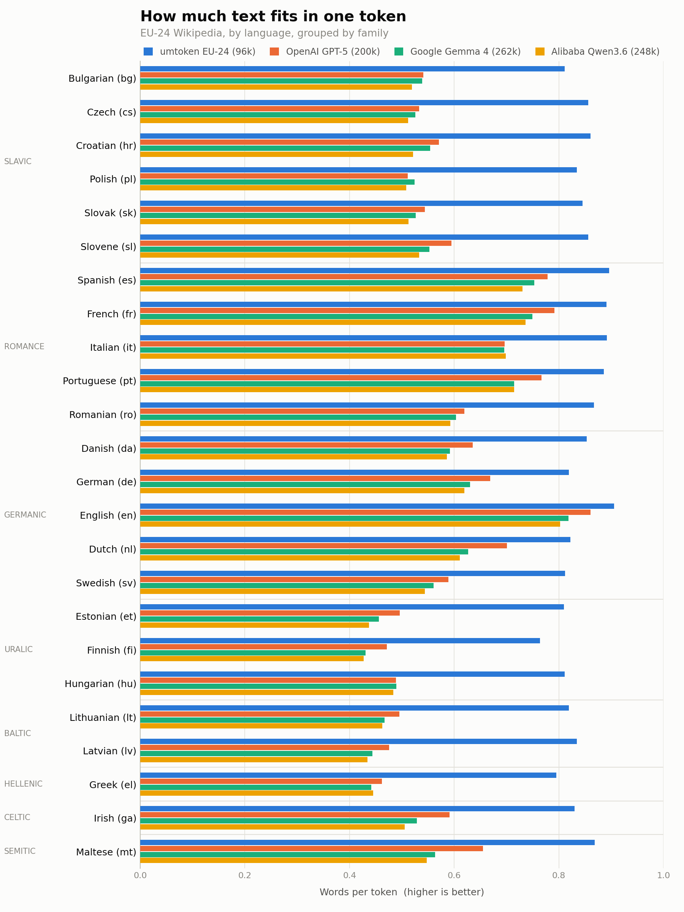
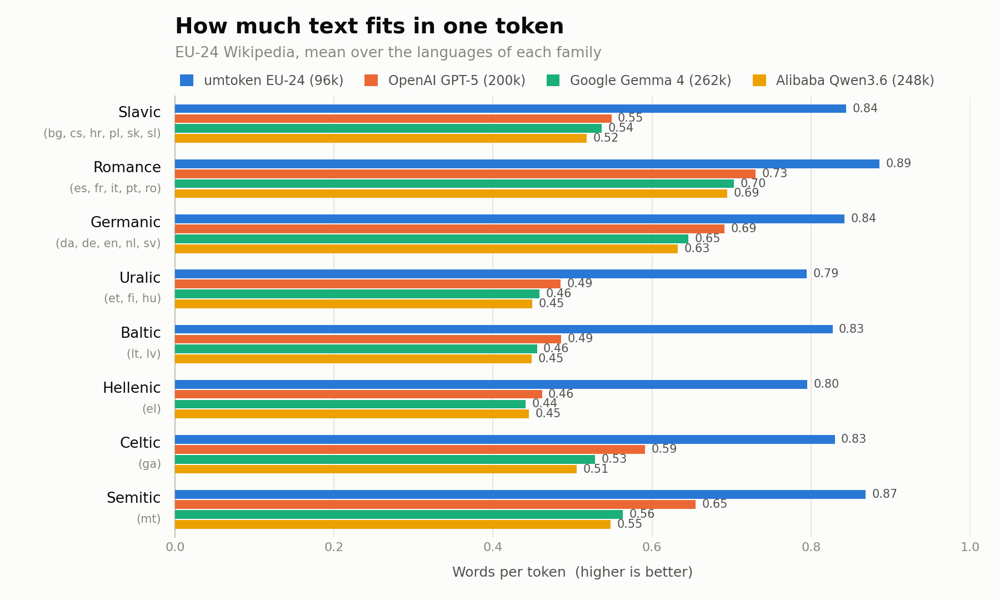

# Benchmarks

Tokens per word for the 24 official EU languages, measured on the
[`HuggingFaceFW/clean-wikipedia`](https://huggingface.co/datasets/HuggingFaceFW/clean-wikipedia)
snapshot — 66.1 GB of text, 11.58 billion words.

| tokenizer | vocab | how it was loaded |
|---|---:|---|
| umtoken EU-24 | 96k | `umtoken/assets/eu24_96k.json` |
| OpenAI GPT-5 | 200k | `o200k_base` via tiktoken |
| Google Gemma 4 | 262k | `google/gemma-4-31B-it` via HF tokenizers |
| Alibaba Qwen3.6 | 248k | `Qwen/Qwen3.6-27B` via HF tokenizers |

## Results

### Two views of one number

The figures and the tables report the same measurement in reciprocal forms, so
watch which way "better" points:

| | unit | direction | used by |
|---|---|---|---|
| **tokens per word** | how many tokens one word costs, e.g. 1.150 | **lower is better** | the tables and the text below |
| **words per token** | how much text one token carries, e.g. 0.870 | **higher is better** | the figures |

They are the same number: `words per token = 1 / tokens per word`. The figures
use the reciprocal because it has a natural ceiling — one token can carry at
most one whole word, so the axis can run from 0 to 1.0 and the bars stay
proportional to the values. Tokens per word has no such ceiling, and it is the
form the literature quotes, so the tables keep it.



Tokens per word, **lower is better**; the best value in each row is bold.

| lang | words | umtoken 96k | gpt5 200k | gemma4 262k | qwen36 248k |
|---|---:|---:|---:|---:|---:|
| bg | 110,367,229 | **1.232** | 1.849 | 1.855 | 1.925 |
| cs | 245,970,488 | **1.168** | 1.875 | 1.902 | 1.954 |
| da | 90,886,975 | **1.172** | 1.573 | 1.689 | 1.706 |
| de | 1,545,128,969 | **1.221** | 1.496 | 1.587 | 1.615 |
| el | 126,360,516 | **1.258** | 2.166 | 2.266 | 2.246 |
| en | 3,566,883,860 | **1.104** | 1.162 | 1.222 | 1.246 |
| es | 1,026,113,750 | **1.116** | 1.285 | 1.328 | 1.369 |
| et | 63,439,947 | **1.235** | 2.016 | 2.194 | 2.287 |
| fi | 148,483,071 | **1.309** | 2.122 | 2.323 | 2.343 |
| fr | 1,453,906,930 | **1.122** | 1.263 | 1.335 | 1.358 |
| ga | 9,993,592 | **1.205** | 1.692 | 1.892 | 1.979 |
| hr | 73,924,766 | **1.162** | 1.753 | 1.806 | 1.917 |
| hu | 218,700,482 | **1.233** | 2.047 | 2.042 | 2.066 |
| it | 856,129,204 | **1.122** | 1.436 | 1.438 | 1.431 |
| lt | 51,323,245 | **1.220** | 2.019 | 2.140 | 2.161 |
| lv | 33,782,563 | **1.198** | 2.102 | 2.255 | 2.303 |
| mt | 6,766,910 | **1.151** | 1.527 | 1.775 | 1.826 |
| nl | 441,870,844 | **1.216** | 1.427 | 1.596 | 1.636 |
| pl | 425,580,830 | **1.198** | 1.957 | 1.908 | 1.968 |
| pt | 499,878,480 | **1.129** | 1.304 | 1.399 | 1.399 |
| ro | 137,860,800 | **1.153** | 1.615 | 1.657 | 1.688 |
| sk | 68,103,297 | **1.183** | 1.839 | 1.900 | 1.950 |
| sl | 79,276,244 | **1.168** | 1.682 | 1.810 | 1.877 |
| sv | 294,416,914 | **1.232** | 1.698 | 1.784 | 1.838 |
| **all** | **11,575,149,906** | **1.150** | **1.403** | **1.467** | **1.494** |

## Findings

**umtoken wins every one of the 24 languages**, at half the vocabulary of the
smallest competitor. Overall the others need 22.0% (gpt5), 27.5% (gemma4) and
29.9% (qwen36) more tokens for the same text.

**The cost is very unevenly distributed.** GPT-5 ranges from 1.162 (`en`) to
2.166 (`el`) — a factor of **1.86**. English, Spanish, Portuguese and French sit
at 1.16-1.30, while Greek, Finnish, Latvian, Lithuanian, Estonian and Hungarian
all exceed 2.0. The same text costs roughly twice as many tokens in Greek as in
English, which carries straight through to context limits, latency and
per-token pricing. umtoken's spread is 1.104-1.309, a factor of **1.18** — close
to language-neutral. Gemma 4 and Qwen3.6 spread 1.90 and 1.88.

**Morphology matters more than script.** Bulgarian and Greek are both non-Latin,
but Bulgarian lands at 1.849 for gpt5 while Greek is at 2.166. Latin-script
Finnish (2.122) and Estonian (2.016) are worse than Cyrillic Bulgarian. The
agglutinative and heavily inflected languages pay the most regardless of script.
This is what the family grouping in the figure below makes visible.



**Vocabulary size is not what decides it.** GPT-5 has the smallest vocabulary of
the three general-purpose tokenizers and still beats both larger ones on 21 of
24 languages; Gemma 4 (262k) takes only `hu` and `pl`, Qwen3.6 (248k) only `el`.
What the extra entries buy depends on which languages the training mix covered,
not on how many entries there are.

## Method

Each language is a single pass over `<corpus>/<lang>/*.arrow`, the `text` column
only — titles, URLs and metadata are excluded. Tokens are counted with
`add_special_tokens=False` / `encode_ordinary`, i.e. no BOS/EOS per document,
which would otherwise inflate the ratio for short documents.

Words are counted with a fixed, tokenizer-independent regex, so the denominator
is identical for every tokenizer:

```
( ?(?:[\p{Ll}\p{Lo}\p{Lm}]+|(?:\p{Lu}\p{Ll}|\p{Lt})[\p{Ll}\p{Lo}\p{Lm}]*|\p{Lu}\p{Lu}[\p{Lu}\p{Lo}\p{Lm}]*(?!\p{Ll})|\d+|(?<! )(\s)\2*|</?(?:su[bp]|u)>|\{(?:==|\+\+|--)|(?:==|\+\+|--)\}|(.)\3*))
```

A leading space belongs to the word, casing patterns are kept apart, and runs of
whitespace or of a repeated character each collapse into one unit.

### Word scope

Where the regex is applied changes the word count by ~2.3%, so it has to be
pinned down:

* **document scope** — the regex runs over the whole document string. The
  newline runs *between* lines then match the `(?<! )(\s)\2*` alternative and
  are counted as words.
* **line scope** — the document is split on `\n` first and the regex is applied
  per line. Newline runs between lines disappear; whitespace runs *inside* a
  line still count.

There is a second, subtler effect at document scope: a newline directly preceded
by a space matches no alternative at all — the `(?<! )` lookbehind rejects the
whitespace branch, and `.` does not match `\n` without `DOTALL`, so the engine
skips the character silently. Line scope removes that inconsistency and is
therefore the default (`--word-scope document` switches).

Measured on `mt`: 6,915,514 words at document scope vs. 6,766,910 at line scope,
+2.20%.

### GPT-5 is one tokenizer, not several

There is no separate published tokenizer per GPT-5 point release. The whole
GPT-5.x family uses the `o200k_harmony` encoding, whose BPE merges are identical
to `o200k_base`; the two differ only in special tokens, which never occur in
corpus text. A single measurement therefore covers GPT-5, 5.1 and 5.2, and it is
computed with tiktoken's `o200k_base`.

The same encoding was used by GPT-4o, so tokenizations published against GPT-4o
remain valid for GPT-5.

## Reproducing

The benchmark lives in the
[umtoken-scripts](https://github.com/ipappify/umtoken-scripts) repository. From
its root:

```bash
python -m benchmarks.clean_wikipedia.eval_tokenizer                  # all tokenizers, all languages
python -m benchmarks.clean_wikipedia.eval_tokenizer -t gpt5 -l de en # subset
python -m benchmarks.clean_wikipedia.eval_tokenizer --limit-rows 1000 # smoke test
python -m benchmarks.clean_wikipedia.plot                            # both figures
```

One pass counts words once and every requested tokenizer alongside it, across
`cpu_count - 2` worker processes over memory-mapped arrow. Results are written
per language as they complete, so an interrupted run resumes where it stopped.
The full corpus takes ~22 minutes on 20 cores per tokenizer. Adding a tokenizer
is one entry in the `TOKENIZERS` dict in `eval_tokenizer.py`.

The umtoken column is produced by [`eval.py`](TOOLS.md#evaluate-tokenizer-evalpy)
rather than by the corpus pass, since umtoken counts over its own extracted
vocabulary. Its word counts agree with the corpus counts to within ±1.6% (median
0.3%); the residual is corpus normalization drift, not a difference in what
counts as a word.
